# OpenCV_intro

# 第一部分(C++版)

>  [官网教程](https://docs.opencv.org/4.x/d9/df8/tutorial_root.html)

## 0.C++

### 0.1 vector

[vector 浅析](https://www.runoob.com/w3cnote/cpp-vector-container-analysis.html)

`std::vector`

- 存放任意类型的动态数组

**基本操作**

- 增加元素

  ```c++
  void push_back(const T& x):向量尾部增加一个元素X
  iterator insert(iterator it,int n,const T& x):向量中迭代器指向元素前增加n个相同的元素x
  ```

- 删除元素

  ```c++
  void pop_back():删除向量中最后一个元素
  void clear():清空向量中所有元素
  ```

## 1.基础

### 1.1 图像读取和显示

直接使用 `imshow` 时，默认为 `AUTOSIZE`，需要拖动改变窗口大小，需设置新的窗口`namedWindow("示例图像1", WINDOW_FREERATIO);` 设置 `WINDOW_FREERATIO` 属性。

```c++
//OpenCV中主要的头文件是include “opencv2/opencv.hpp”它可以调用每个 Opencv 模块的头文件
#include <opencv2/opencv.hpp>
#include <iostream>
using namespace std;
using namespace cv;
int main()
{
	// Matrix 矩阵
	//本地文件路径，E:/OpenCV_intro/test_img/01.jpg
	Mat img = imread("E:/OpenCV_intro/test_img/01.jpg", IMREAD_GRAYSCALE); //灰度图像IMREAD_GRAYSCALE
	if (img.empty()) {
		printf("could not load image!\n");
		return -1;
	}
	namedWindow("示例图像1", WINDOW_FREERATIO);//FREEATIO
	imshow("示例图像1", img); //imshow无法调整图片,默认AUTOSIZE
	waitKey(0); // 1 表示1ms
    imwrite("E:/OpenCV_intro/test_img/01_gray.jpg", img); //保存
	destroyAllWindows();
	return 0;
}

```

### 1.2 运行源码中的示例

位置：`D:\opencv\sources\samples\cpp`

**1.边缘检测**

点击 `源文件`，添加 `现有项目` 中的 `edge.cpp`，提示找不到对应的 lib 文件的话可以重启系统。

使用 `CMD`在生成的 `.exe` 文件夹下对目标照片操作：

```cmd
.\OpenCV4_extra01 01.jpg
```

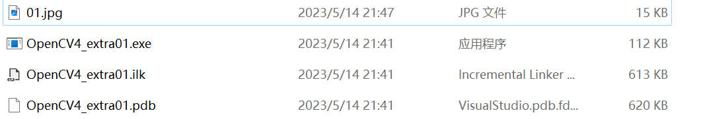

**2.K聚类**

`kmeans.cpp`：直接构建并运行即可，不需要参数

按空格键可交互，`esc` 键退出

**3.借助相机进行目标跟踪**

`camshiftdemo.cpp`: 调用相机进行目标跟踪

命令参数的输入可在 `debug|×64` 右键，在调试选项中输入：

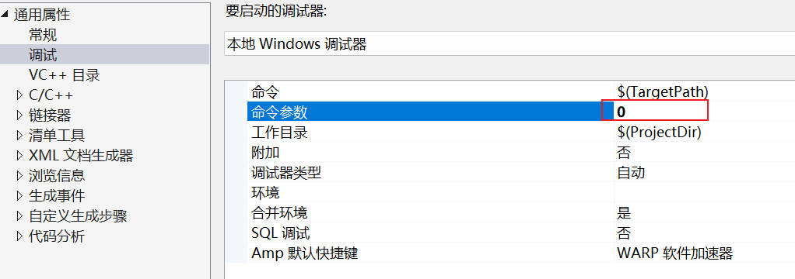

按键说明：

```c++
string hot_keys =
    "\n\nHot keys: \n"
    "\tESC - quit the program\n"
    "\tc - stop the tracking\n"
    "\tb - switch to/from backprojection view\n"
    "\th - show/hide object histogram\n"
    "\tp - pause video\n"
    "To initialize tracking, select the object with mouse\n";
```

## 2. Mat 容器

[官网 Mat 类解读](https://docs.opencv.org/4.6.0/d3/d63/classcv_1_1Mat.html#a2ec3402f7d165ca34c7fd6e8498a62ca)

Mat 类： OpenCV 用于存储矩阵数据类型，类似于 int，double 类型

Mat 能存储的数据：

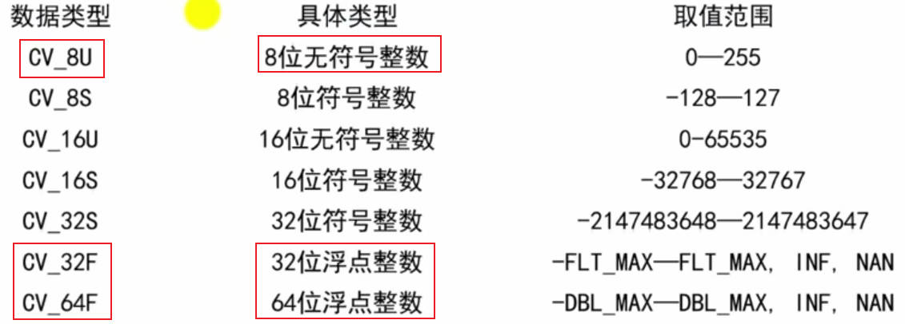

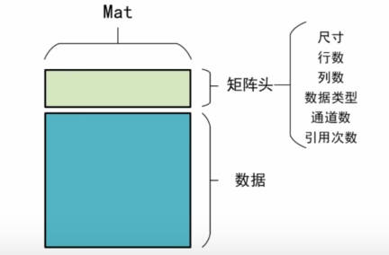

### 2.1 创建 Mat 类

- 利用矩阵的宽，高，类型参数创建 Mat 类
- 利用 Size() 结构和数据类型参数创建 Mat 类
- 利用原有的 Mat 类创建

```c++
cv::Mat::Mat(	
int 	rows,
int 	cols,
int 	type 
)	
//CV_8U(n) 其中 n 用来构建多通道数，最大为 512
//CV_8UC1,CV_64FC1 等是从 1-4
Mat demo(3, 3, CV_8U)
Mat a(Size(3,3), CV_8U)

//利用已有的 Mat 类创建
//[2,5)第2行到第5行，第2列到第5列
c = Mat(a, Range(2,5), Range(2,5))
```

**赋值 Mat 类**

```c++
Mat demo(3, 3, CV_8U, Scalar(0))
//eye,diag,zeros,ones
```

### 2.2 读取 Mat 类

```c++
a.cols
a.rows
a.step
```

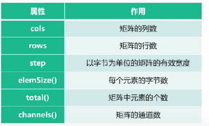

**at 方法读取**

**需要知道读取的数据类型**

Vec3b: 3 个通道 uchar 类型的

Vec4i: 4 个通道 int 类型的

Vec2d: 2 个通道 double 类型的

```c++
//单通道
int value = (int)a.at<uchar>(0,0);
//多通道，Vec3b 3通道，中的 b 代表uchar类型，d 代表double
cv::Vec3b vc3 = b.at<cv::Vec3b>(0, 0);
int first = (int)vc3.val[0];
```

**地址定位方式访问**

```c++
//不用考虑数据类型
//单通道(row, col, channel)
(int)(*(b.data + b.step[0] * row + b.step[1] * col + channel));
```

### 2.3 符号运算

数据类型和尺寸的一致性

矩阵乘积：

- 矩阵的乘积
- 内积，数据个数一致即可
- 对应元素相乘

```c++
a*b;
a.dot(b);
a.mul(b);
```


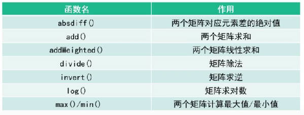

```c++
#include <opencv2/opencv.hpp>
#include <iostream>

using namespace cv;
using namespace std;

int main() {
	system("color F0");
	//CV_8U类型，通道数1
	Mat a(3, 3, CV_8UC1);
	Mat b(Size(4, 4), CV_8UC1);

	//赋值
	//5×5×3
	Mat c3(5, 5, CV_8UC3, Scalar(4, 5, 6));
	Vec3b vc3_uchar = c3.at<Vec3b>(0, 0);
	cout << vc3_uchar << endl;
	cout <<"3通道赋值\n" << c3 << endl;
	cout << "step[0]:" << c3.step[0] << endl;
	cout << "step[1]:" << c3.step[1] << endl;
	//枚举赋值
	Mat d = ( cv::Mat_<int>(1, 5) << 1, 2, 3, 4, 5 );
	//产生对角矩阵

	Mat e = Mat::diag(d);
	//从0开始计数
	Mat f = Mat(e, Range(2, 4), Range(2, 4));
	cout << "枚举赋值\n" << d << endl;
	cout << "对角阵选取\n" << e << endl;
	cout << "选取\n" <<f << endl;

}
```

### 2.4 图像读取，显示保存

**imread**

[官方说明](https://docs.opencv.org/4.6.0/d4/da8/group__imgcodecs.html#ga288b8b3da0892bd651fce07b3bbd3a56)

imread 读入，imshow 显示

```c++
// a.imread("路径"，flags窗口属性的标志)
```

**namedWindow**

```c++
//name 窗口名
nameWindow(name, flags);
imshow(winname, mat);
//filename 保存的路径，Mat 类图像的名字,图片属性的设置 
imwrite(filename, img, params)
```

**Image Watch**

[ImageWatch](https://marketplace.visualstudio.com/search?term=image&target=VS&category=Tools&vsVersion=&subCategory=All&sortBy=Relevance) | [Image Watch VS 2017 版](https://marketplace.visualstudio.com/items?itemName=VisualCPPTeam.ImageWatch2017)

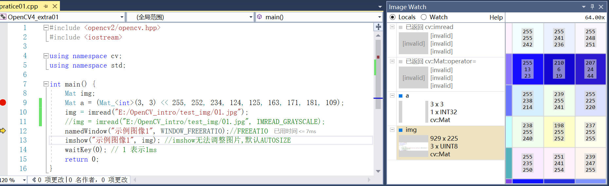

### 2.5 视频加载和调用摄像头

VideoCapture

filename: 读取的视频名称

apiPreference: 读取数据时设置的属性，如编码格式，是否调用 OpenNI

```c++
//VideoCapture(filename, apiPreference);
//对每帧视频的读取
int main() {
	VideoCapture video;
	video.open("no.mp4");
	if (!video.isOpened())
	{
		cout << "视频路径错误或者不存咋!";
		return -1;
	}
	//property
	cout <<"视频帧率" << video.get(CAP_PROP_FPS) << endl;
	cout << "视频宽度" << video.get(CAP_PROP_FRAME_WIDTH) << endl;
	while (1)
	{
		Mat frame;!
		video >> frame;//存储每一帧的图像
		if (frame.empty())
		{
			break;
		}
		imshow("video_name", frame); //显示每一帧
		////每秒放多少帧，计算每个帧的时间间隔
		uchar c = waitKey(1000/ video.get(CAP_PROP_FPS)); 
		if (c == 'q')
		{
			break;
		}
	}
	return 0;
}
```

**调用摄像头**

```c++
int main() {
	Mat img;
	VideoCapture video;
	video.open(0);
	if (!video.isOpened())
	{
		cout << "摄像头调用失败!";
		return -1;
	}
	
	video.set(CAP_PROP_FPS, 30);//设置帧率
	cout << "视频帧率" << video.get(CAP_PROP_FPS) << endl;
	cout << "视频宽度" << video.get(CAP_PROP_FRAME_WIDTH) << endl;
	while (1)
	{
		Mat frame;
		video >> frame;
		if (frame.empty())
		{
			break;
		}
		imshow("video_name", frame); //显示每一帧
		////每秒放多少帧，计算每个帧的时间间隔
		uchar c = waitKey(1000 / video.get(CAP_PROP_FPS));
		if (c == 'q')
		{
			break;
		}
	}

	video >> img;
	if (img.empty())
	{
		cout << "获取图像失败" << endl;
		return -1;
	}
	//是否为彩色图片,3通道彩色图片
	bool isColor = (img.type() == CV_8UC3);

	VideoWriter writer;
	int codec = VideoWriter::fourcc('M', 'J', 'P', 'G');//选择编码格式
	double fps = 25.0; //设置帧率

	string filename = "E:/Desktop/test01.avi";
	writer.open(filename, codec, fps, img.size(), isColor);
	if (!writer.isOpened())
	{
		cout << "打开视频文件失败" << endl;
	}


	while (1)
	{
		if (!video.read(img))
		{
			cout << "摄像头断开链接或视频读取完成" << endl;
			return -1;
		}
		writer.write(img);//图像写入视频流，writer << img
		imshow("显示写入视频的图像", img);
		char c = waitKey(50);
		if (c == 'q')
		{
			break;
		}
		//video.release();
		//writer.release();
	}
	return 0;
}
```


### 2.6 颜色转换

**RGB**

8U：0-255；f32：0-1；d64：0-1

```c++
void cv::Mat::convertTo	(	OutputArray 	m,
int 	rtype,
double 	alpha = 1,
double 	beta = 0 
)		constc
//0-225转换为0-1
a.convertTo(b, CV_32F, 1/255.0, 0)
```

m：输出图像；rtype：转换后的数据类型；alpha：缩放系数；beta：平移系数

**HSV**

H: Hue 色度，即颜色；S: Saturation，饱和度，深浅；V: value，亮度

**GRAY** 

0-127-255

只能由彩色转换为灰色，反之则不行。

```c++
void cv::cvtColor	(	InputArray 	src,
OutputArray 	dst,
int 	code,
int 	dstCn = 0 
)		
```

src: 原始图像

dst: 转换后的图像

code: 颜色转换的标志

dstCn: 目标图像中的通道数，如果参数为 0，则从自动导出

```c++
int main() {
	Mat img = imread("E:/AI_learning/06CV_intro/OpenCV_intro/test_img/bg01.jpg");;
	Mat img32;
	Mat HSV, HSV32;
	img.convertTo(img32, CV_32F, 1 / 255.0, 0); //0-255转换为0-1
	cvtColor(img, HSV, COLOR_BGR2HSV, 0);
	cvtColor(img32, HSV32, COLOR_BGR2HSV, 0);

	Mat gray0, gray1;
	cvtColor(img, gray0, COLOR_BGR2GRAY, 0); //转换为灰度,BRG比RGB的排列顺序不同，结果更亮
	cvtColor(img, gray1, COLOR_RGB2GRAY, 0);
	
	return 0;
}
```

### 2.7 多通道分离

[split](https://docs.opencv.org/4.x/d2/de8/group__core__array.html#ga8027f9deee1e42716be8039e5863fbd9)

```c++
void cv::split	(	InputArray 	m,
OutputArrayOfArrays 	mv 
)	
```

需分离的图像；分离后的单通道图像，表现为向量类型

```c++
int main() {
	Mat img = imread("E:/AI_learning/06CV_intro/OpenCV_intro/test_img/bg01.jpg");;
	Mat img32;
	img.convertTo(img32, CV_32F, 1 / 255.0, 0); //0-255转换为0-1
	
    Mat img_merge;
	Mat imgs[3]; //定义的分离向量数组
    
	split(img, imgs);
	Mat img0 = imgs[0];
	Mat img1 = imgs[1];
	Mat img2 = imgs[2];
    
    merge(imgs, 3, img_merge);

	return 0;
}
```

[merge](https://docs.opencv.org/4.x/d2/de8/group__core__array.html#ga61f2f2bde4a0a0154b2333ea504fab1d)

```c++
void cv::merge	(	const Mat * 	mv,
size_t 	count,
OutputArray 	dst 
)	

void cv::merge	(	InputArrayOfArrays 	mv,
OutputArray 	dst 
)	
```

# 第二部分(Python版)

> [opencv-python 原版文档](https://docs.opencv.org/4.1.2/d6/d00/tutorial_py_root.html)
>
> [opencv-python 中文官方文档](http://www.woshicver.com/)
>
> [教程 Learn-OpenCV-in-3-hours](https://github.com/murtazahassan/Learn-OpenCV-in-3-hours)

## 目录

- [0.Introduction to OpenCV](https://docs.opencv.org/4.1.2/da/df6/tutorial_py_table_of_contents_setup.html)
- [1.Gui Features in OpenCV](https://docs.opencv.org/4.1.2/dc/d4d/tutorial_py_table_of_contents_gui.html)
- [2.Core Operations](https://docs.opencv.org/4.1.2/d7/d16/tutorial_py_table_of_contents_core.html)
- [3.Image Processing in OpenCV](https://docs.opencv.org/4.1.2/d2/d96/tutorial_py_table_of_contents_imgproc.html)
- 


## 0.简介

**直接安装**

[**Install OpenCV-Python in Windows**](https://docs.opencv.org/4.1.2/d5/de5/tutorial_py_setup_in_windows.html)

```bash
pip install numpy
pip install matplotlib
pip install opencv-python
```

**包导入**

```python
import cv2 as cv
print( cv.__version__ )
```

## 1. GUI

**[Gui Features in OpenCV](https://docs.opencv.org/4.1.2/dc/d4d/tutorial_py_table_of_contents_gui.html)**

### 1.1图像

[**Getting Started with Images**](https://docs.opencv.org/4.1.2/dc/d2e/tutorial_py_image_display.html)

**[cv.imread()](https://docs.opencv.org/4.1.2/d4/da8/group__imgcodecs.html#ga288b8b3da0892bd651fce07b3bbd3a56)**: 读取图片，("01.jpg", 0)，0 表示读取方式为灰度

**[cv.imshow()](https://docs.opencv.org/4.1.2/d7/dfc/group__highgui.html#ga453d42fe4cb60e5723281a89973ee563)**: 显示

**[cv.imwrite()](https://docs.opencv.org/4.1.2/d4/da8/group__imgcodecs.html#gabbc7ef1aa2edfaa87772f1202d67e0ce)**: 保存

彩色图片在 OpenCV 默认以BGR 模式读取，在 Matplotlib 中则以 RGB 模式显示

### 1.2视频

[**Getting Started with Videos**](https://docs.opencv.org/4.1.2/dd/d43/tutorial_py_video_display.html)

**[cv.VideoCapture()](https://docs.opencv.org/4.1.2/d8/dfe/classcv_1_1VideoCapture.html)**:  per second of frames，fps

**[cv.VideoWriter()](https://docs.opencv.org/4.1.2/dd/d9e/classcv_1_1VideoWriter.html)**: 

VGA: 640×480

HD: 1280×720

FHD: 1920×1080

4K: 3840×2160

灰度图像：0-255，除了 0 表示黑，255 表示白，中间 244 个值表示灰度；

关于 propId 数值对应的含义见：**[Flags for video I/O](https://docs.opencv.org/4.x/d4/d15/group__videoio__flags__base.html#gaeb8dd9c89c10a5c63c139bf7c4f5704d)**

```python
framewidth = 640
frameheight = 480
fps = 30 # 设置帧率

# 其中propId是0到18之间的一个数字。每个数字表示视频的属性
# cap.set(propID, value)

# cap = cv2.VideoCapture("video/test01.avi")
cap = cv.VideoCapture(0, cv.CAP_DSHOW)
cap.set(cv.CAP_PROP_FRAME_WIDTH, framewidth) #id-3
cap.set(cv.CAP_PROP_FRAME_HEIGHT, frameheight) #id-4
cap.set(cv.CAP_PROP_FPS, fps) #id-5
cap.set(cv.CAP_PROP_BRIGHTNESS, 1) #id-10

while cap.isOpened():
    success, img = cap.read()
    cv.imshow("video", img)
    # gray = cv.cvtColor(img, cv.COLOR_BGR2GRAY)
    # cv.imshow("gray", gray)
    if cv.waitKey(1) & 0xFF == ord('q'):
        break
```

**借助 VideoWriter 对象保存**

- 文件路径，包含文件名 filename

- 设置编码形式 FourCC, 4-bytes, 如  MJPG (.mp4), DIVX (.avi)

  `cv.VideoWriter_fourcc('M','J','P','G')` 或者 `(*'MJPG')`

- frames per second (fps)

- frame size 

- isColor, 为真则以彩色图片保存；否则以灰度图片保存

**cap 对象，实时获取摄像机视频帧 => frame => out 对象**

```python
out = cv.VideoWriter('output.avi', fourcc, 20.0, (640,  480)) #定义一个VideoWriter对象，用于接受视频帧

out.write(frame) #将获取的帧写入对象中
cv.imshow('frame', frame)# 显示获取的帧
```

### 1.3 绘制图像

[**Drawing Functions in OpenCV**](https://docs.opencv.org/4.1.2/dc/da5/tutorial_py_drawing_functions.html)

Opencv 中：**先宽后高**

numpy 中：**先高后宽**

```python
# [0, 256)
img = np.random.randint(0, 256, (512, 500, 3), dtype=np.uint8)
img[:] = 255, 255, 1
# img = cv.imread("img/01.jpg")
print(img.shape)

# 定义线，起点；终点；颜色; 粗细
# img.shape=(高， 宽)
cv.line(img, (0,0), (img.shape[0], img.shape[1]), (0, 0, 255), 1)
cv.putText(img, "demo_test", (100, 100), cv.FONT_HERSHEY_COMPLEX, 1, (255, 0, 0), 1)

cv.imshow("define_image", img)
cv.waitKey(0)

cv.destroyAllWindows()
```

### 1.4 鼠标刷

[**Mouse as a Paint-Brush**](https://docs.opencv.org/4.1.2/db/d5b/tutorial_py_mouse_handling.html)

### 1.5 色彩棒

[**Trackbar as the Color Palette**](https://docs.opencv.org/4.1.2/d9/dc8/tutorial_py_trackbar.html)：通过滑动调整相应的值

**[cv.getTrackbarPos()](https://docs.opencv.org/4.1.2/d7/dfc/group__highgui.html#ga122632e9e91b9ec06943472c55d9cda8)**

**[cv.createTrackbar()](https://docs.opencv.org/4.1.2/d7/dfc/group__highgui.html#gaf78d2155d30b728fc413803745b67a9b)**

```python
import cv2 as cv
import numpy as np

def doNothing():
    pass
img = np.zeros((300,512,3), np.uint8)

cv.namedWindow("image_01")

cv.createTrackbar("R", "image_01", 0, 255, doNothing)
cv.createTrackbar("G", "image_01", 0, 255, doNothing)
cv.createTrackbar("B", "image_01", 0, 255, doNothing)

switch = '0:OFF \n1: ON'
cv.createTrackbar(switch, 'image_01', 0, 1, doNothing)
while(1):
    cv.imshow('image_01', img)
    k = cv.waitKey(1) & 0xFF
    if k == 27:
        break
    r = cv.getTrackbarPos("R", "image_01")
    g = cv.getTrackbarPos("G", "image_01")
    b = cv.getTrackbarPos("B", "image_01")
    s = cv.getTrackbarPos(switch, "image_01")

    if s == 0:
        img[:] = 0
    else:
        img[:] = [b, g, r]

cv.destroyAllWindows()
```

实时交互型：使用 `waitkey(1)` 不是 `waitkey(0)`

```python
def empty(a):
    pass


cv.namedWindow("example_windows")
cv.resizeWindow("example_windows", 640, 340)
cv.createTrackbar("hue_min", "example_windows", 0, 179, empty)
cv.createTrackbar("hue_max", "example_windows", 179, 179, empty)
cv.createTrackbar("sat_min", "example_windows", 0, 255, empty)
cv.createTrackbar("sat_max", "example_windows", 255, 255, empty)
cv.createTrackbar("val_min", "example_windows", 0, 255, empty)
cv.createTrackbar("val_max", "example_windows", 255, 255, empty)


while(1):
    img = cv.imread("img/03.jpg")
    img_HSV = cv.cvtColor(img, cv.COLOR_BGR2HSV)
    h_min = cv.getTrackbarPos("hue_min", "example_windows")
    s_min = cv.getTrackbarPos("sat_min", "example_windows")
    v_min = cv.getTrackbarPos("val_min", "example_windows")
    h_max = cv.getTrackbarPos("hue_max", "example_windows")
    s_max = cv.getTrackbarPos("sat_max", "example_windows")
    v_max = cv.getTrackbarPos("val_max", "example_windows")
    
    print(h_min, h_max, s_min, s_max, v_min, v_max)
    lower_array = np.array([h_min, s_min, v_min])
    upper_array = np.array([h_max, s_max, v_max])
    mask = cv.inRange(img_HSV, lower_array, upper_array)

    cv.imshow("HSV", img_HSV)
    cv.imshow("mask", mask)
    k = cv.waitKey(1)
    if k == "q":
        break
cv.destroyAllWindows()
```

## 2.基础核心操作

**[Core Operations](https://docs.opencv.org/4.1.2/d7/d16/tutorial_py_table_of_contents_core.html)**

图片的坐标轴表示，y 轴向下为正：

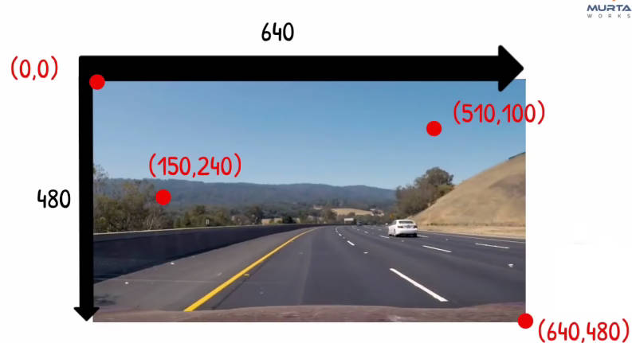

### 2.1 基础操作

**[Basic Operations on Images](https://docs.opencv.org/4.1.2/d3/df2/tutorial_py_basic_ops.html)**

**OpenCV 默认访问的是：BGR 形式，即 [100, 100, 0] => blue, 1=> green, 2=> red**

**img ROI (region of interes)**

用感兴趣的的区域实现图片的叠加：

```python
# print(340-280, 333-273)
# 图片分割,将图中的足球分割出来
img = cv.imread("img/roi_test.jpg")
print(img.shape) # 输出高，宽
ball = img[220:280, 330:390]
# print(ball)
img[213:273, 85:145] = ball

cv.imshow('a', img)
cv.waitKey(0)
cv.destroyAllWindows()
```

**边界填充-[cv.copyMakeBorder](https://docs.opencv.org/4.1.2/d2/de8/group__core__array.html#ga2ac1049c2c3dd25c2b41bffe17658a36)**

**注意：cv2是默认BGR顺序，而用plt.imshow画图是RGB顺序**

```python
# 边界填充
BLUE = [255,0,0]
img = cv.imread("img/03.jpg")
# (src, top, bottom, left, right, bodertype)
replicate = cv.copyMakeBorder(img,10,10,10,10,cv.BORDER_REPLICATE)
reflect = cv.copyMakeBorder(img,10,10,10,10,cv.BORDER_REFLECT)
reflect101 = cv.copyMakeBorder(img,10,10,10,10,cv.BORDER_REFLECT_101)
wrap = cv.copyMakeBorder(img,10,10,10,10,cv.BORDER_WRAP)
constant= cv.copyMakeBorder(img,10,10,10,10,cv.BORDER_CONSTANT,value=BLUE)

# cv2是默认BGR顺序，而用plt.imshow画图是RGB顺序
plt.subplot(231),plt.imshow(img),plt.title('ORIGINAL')
plt.subplot(232),plt.imshow(replicate,'gray'),plt.title('REPLICATE')
plt.subplot(233),plt.imshow(reflect,'gray'),plt.title('REFLECT')
plt.subplot(234),plt.imshow(reflect101,'gray'),plt.title('REFLECT_101')
plt.subplot(235),plt.imshow(wrap,'gray'),plt.title('WRAP')
plt.subplot(236),plt.imshow(constant,'gray'),plt.title('CONSTANT')

plt.show()

cv.imshow('a', img)
cv.waitKey(0)
cv.destroyAllWindows()
```

### 2.2 图片几何操作

**[Arithmetic Operations on Images](https://docs.opencv.org/4.1.2/d0/d86/tutorial_py_image_arithmetics.html)**

 **[cv.add()](https://docs.opencv.org/4.1.2/d2/de8/group__core__array.html#ga10ac1bfb180e2cfda1701d06c24fdbd6)**：区分 OpenCV 和 Numpy 的相加的不同，**OpenCV 的操作结果更好**

OpenCV addition：saturated operation

Numpy addition：a modulo operation (取模运算)


**[cv.addWeighted()](https://docs.opencv.org/4.1.2/d2/de8/group__core__array.html#gafafb2513349db3bcff51f54ee5592a19)** ：图像混合 (Image Blending)
$$
dst = \alpha \cdot img1 + \beta \cdot img2 + \gamma
$$

```python
# 图片融合操作
img1 = cv.imread("img/01.jpg")
print(img1.shape)
img2 = cv.imread("img/02.jpg")
print(img2.shape)
img2 = img2[0:img1.shape[0], 0:img1.shape[1]]

dst = cv.addWeighted(img1,0.1,img2,0.8,0)

cv.imshow('dst', dst)
cv.waitKey(0)
cv.destroyAllWindows()
```

**添加水印图片：注意主图片的宽高应都大于水印图片的宽高**

```python
# 图片位操作
logo = cv.imread("img/opencv-logo-white.jpg")
# 确保操作的图片宽高都大于水印的大小
main_img = cv.imread("img/01.jpg")
# print(main_img.shape)
rows, cols, channels = logo.shape
roi = main_img[0:rows, 0:cols]
# print("roi_shape", roi.shape)

logo_gray = cv.cvtColor(logo, cv.COLOR_BGR2GRAY)
# 转换为二值图像，10-阈值，255-填充色，0黑
# 使用固定阈值进行二值处理,大于时取 255，反之取 0；
ret, mask = cv.threshold(logo_gray, 30, 255, cv.THRESH_BINARY)

mask_inv = cv.bitwise_not(mask) # 取反,变为白底
# print("logo_shape", logo.shape)
logo_fg = cv.bitwise_and(logo, logo, mask=mask) # 将logo区域外的地方置0，得到前景
main_bg = cv.bitwise_and(roi, roi, mask=mask_inv) # 将 ROI 的logo 区域设置为 0
dst = cv.add(logo_fg, main_bg)
main_img[0:rows, 0:cols ] = dst


plt.subplot(441),plt.imshow(imgBGR2RGB(logo),'gray'),plt.title('original')
plt.subplot(442),plt.imshow(imgBGR2RGB(mask),'gray'),plt.title('mask')
plt.subplot(443),plt.imshow(imgBGR2RGB(mask_inv),'gray'),plt.title('mask_inv')
plt.subplot(444),plt.imshow(imgBGR2RGB(logo_fg),'gray'),plt.title('logo_fg')
plt.subplot(412),plt.imshow(imgBGR2RGB(main_img),'gray'),plt.title('main_img')
plt.subplot(413),plt.imshow(main_img,'gray'),plt.title('main_img')
plt.subplot(414),plt.imshow(main_img,'gray'),plt.title('main_img')

plt.show()
```

### 2.3 代码执行的效率

[**Performance Measurement and Improvement Techniques**](https://docs.opencv.org/4.1.2/dc/d71/tutorial_py_optimization.html)

**[cv.getTickCount](https://docs.opencv.org/4.1.2/db/de0/group__core__utils.html#gae73f58000611a1af25dd36d496bf4487)**: 在程序执行前后使用，计算时间或使用 `time.time()`

**[cv.getTickFrequency](https://docs.opencv.org/4.1.2/db/de0/group__core__utils.html#ga705441a9ef01f47acdc55d87fbe5090c)**: 频次

**优化**

除非数组很大，否则 pyhton 原生的向量操作速度大于 numpy 的操作速度；

[IPython 的魔法方法](https://pynash.org/2013/03/06/timing-and-profiling/)

- `%time` & `%timeit`: See how long a script takes to run (one time, or averaged over a bunch of runs).
- `%prun`: See how long it took each function in a script to run.
- `%lprun`: See how long it took each line in a function to run.
- `%mprun` & `%memit`: See how much memory a script uses (line-by-line, or averaged over a bunch of runs).


## 3.图像操作

[**Image Processing in OpenCV**](https://docs.opencv.org/4.1.2/d2/d96/tutorial_py_table_of_contents_imgproc.html)

### 3.1 色彩变换

[**Changing Colorspaces**](https://docs.opencv.org/4.1.2/df/d9d/tutorial_py_colorspaces.html)

将图片从一种色彩形式转换 **(,cvt，convert**) 为另一种，常见的如： **BGR ↔ Gray, BGR ↔ HSV**

```python
 flags = [i for i in dir(cv) if i.startswith('COLOR_')]
 
 hsv = cv.cvtColor(frame, cv.COLOR_BGR2HSV)
```

### 3.2 几何变换

**[Geometric Transformations of Images](https://docs.opencv.org/4.1.2/da/d6e/tutorial_py_geometric_transformations.html)**

**[cv.getPerspectiveTransform](https://docs.opencv.org/4.1.2/da/d54/group__imgproc__transform.html#ga20f62aa3235d869c9956436c870893ae)**

**尺寸倍数变换**

```python
# 放大并保存
img = cv.imread("img/03.jpg")
print("放大前：", img.shape)
# 放大倍数 fx,fy
res = cv.resize(img, None, fx=2, fy=2, interpolation=cv.INTER_CUBIC)
print("放大后：", res.shape)
cv.imshow('res', res)
c = cv.waitKey(0)
if c==27 or c == ord('q'):
    cv.destroyAllWindows()
elif c==ord('s'):
    cv.imwrite('img_scale.jpg', res)
    cv.destroyAllWindows()

# 或采用另一种方法
height, width = img.shape[:2]
res = cv.resize(img,(2*width, 2*height), interpolation = cv.INTER_CUBIC)
```

**1.平移操作**
$$
M = \begin{bmatrix} 1 & 0 & t_x \\ 0 & 1 & t_y \end{bmatrix}
$$

```python
# 平移操作
img = cv.imread("img/03.jpg", 0)
rows, cols = img.shape
print(img.shape)
# print(rows)
# print(img.shape[0])
# [[1,0,move_x],[0,1,move_y]], 输出图片的尺寸：(width, height)
translation_M = np.float32([[1,0,100], [0,1,0]])
img_move = cv.warpAffine(img, translation_M, (img.shape[1], img.shape[0]))

cv.imshow('dst', img_move)
cv.waitKey(0)
cv.destroyAllWindows()
```

**2.旋转**
$$
M = \begin{bmatrix} cos\theta & -sin\theta \\ sin\theta & cos\theta \end{bmatrix}
$$

```python
# 旋转操作
img = cv.imread("img/03.jpg", 0)
rows, cols = img.shape
# 正直为逆时针旋转
rotation_M = cv.getRotationMatrix2D(((rows-1)/2, (cols-1)/2), 45, 1)
rotation_img = cv.warpAffine(img, rotation_M, (cols, rows))

cv.imshow('dst', rotation_img)
cv.waitKey(0)
cv.destroyAllWindows()
```

**3.仿射变换**

[仿射变换解读](https://www.cnblogs.com/happystudyeveryday/p/10547316.html)


### 3.3 形态变换

[**Morphological Transformations**](https://docs.opencv.org/4.1.2/d9/d61/tutorial_py_morphological_ops.html)

适用于二值图 ( binary images)，借助矩阵操作 (使用 numpy 包)。

 **[cv.erode()](https://docs.opencv.org/4.1.2/d4/d86/group__imgproc__filter.html#gaeb1e0c1033e3f6b891a25d0511362aeb)**: 腐蚀

**[cv.dilate()](https://docs.opencv.org/4.1.2/d4/d86/group__imgproc__filter.html#ga4ff0f3318642c4f469d0e11f242f3b6c)**: 膨胀

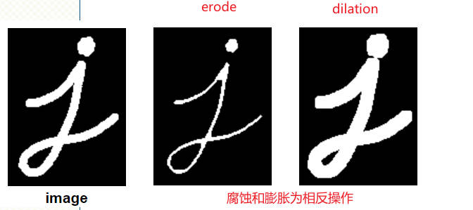

```python
import cv2 as cv
import numpy as np

kernel = np.ones((5, 5), np.uint8)
img = cv.imread("img/03.jpg")

img_gray = cv.cvtColor(img, cv.COLOR_BGR2GRAY)
img_blur = cv.GaussianBlur(img, (7, 7), 0)
img_canny = cv.Canny(img, 150, 200) # 边缘检测
img_dilation = cv.dilate(img_gray, kernel, iterations=1) # 迭代一次
img_erode = cv.erode(img_gray, kernel, iterations=1) # 迭代一次

# cv.imshow("name01", img_gray)
# cv.imshow("blur", img_blur)
cv.imshow("canny", img_canny)
cv.imshow("canny_dilation", img_dilation)
cv.imshow("canny_erode", img_erode)

c = cv.waitKey(0)
```

### 3.4 二值化

**[Image Thresholding](https://docs.opencv.org/4.1.2/d7/d4d/tutorial_py_thresholding.html)**

-  **[cv.threshold](https://docs.opencv.org/4.1.2/d7/d1b/group__imgproc__misc.html#gae8a4a146d1ca78c626a53577199e9c57)**：(必须是灰色图像 img_gray，阈值(小于阈值取0)，超过阈值赋予的最大值，二值化方法)

  返回值：ret (设置的阈值)，二值图像

```python
img = cv.imread('img/03.jpg',0)
ret,thresh1 = cv.threshold(img,127,255,cv.THRESH_BINARY)
ret,thresh2 = cv.threshold(img,127,255,cv.THRESH_BINARY_INV)
ret,thresh3 = cv.threshold(img,127,255,cv.THRESH_TRUNC)
ret,thresh4 = cv.threshold(img,127,255,cv.THRESH_TOZERO)
ret,thresh5 = cv.threshold(img,127,255,cv.THRESH_TOZERO_INV)
titles = ['Original Image','BINARY','BINARY_INV','TRUNC','TOZERO','TOZERO_INV']
images = [img, thresh1, thresh2, thresh3, thresh4, thresh5]
for i in range(6):
    plt.subplot(2,3,i+1),plt.imshow(images[i],'gray')
    plt.title(titles[i])
    plt.xticks([]),plt.yticks([])
plt.show()
```

- **[cv.adaptiveThreshold](https://docs.opencv.org/4.1.2/d7/d1b/group__imgproc__misc.html#ga72b913f352e4a1b1b397736707afcde3)** (自适应阈值)：`dst=cv.adaptiveThreshold(src, maxValue, adaptiveMethod, thresholdType,  C[, dst])`

  `adaptiveMethod` 决定如何计算阈值，如 `cv.ADAPTIVE_THRESH_GAUSSIAN_C`:阈值是邻域值减去常数C的高斯加权和；

  `thresholdType` 同 `cv.threshold` 中的参数；

  `blockSize` 邻域面积大小，**奇数**

```python
# 自适应阈值设定
img_gray = cv.imread("img/03.jpg", 0)
# ret, img = cv.threshold(img_gray, 150, 255, cv.THRESH_BINARY)
# 像素数19×19-奇数，常数 C=9
img_threshold = cv.adaptiveThreshold(img_gray, 255,  cv.ADAPTIVE_THRESH_GAUSSIAN_C, cv.THRESH_BINARY, 21, 2)
cv.imshow("threshold image", img_threshold)

cv.waitKey(0)
cv.destroyAllWindows()
```

### 3.5 轮廓检测

**[Contours in OpenCV](https://docs.opencv.org/4.1.2/d3/d05/tutorial_py_table_of_contents_contours.html)**

- **[cv.findContours()](https://docs.opencv.org/4.1.2/d3/dc0/group__imgproc__shape.html#gadf1ad6a0b82947fa1fe3c3d497f260e0)**

- **[cv.drawContours()](https://docs.opencv.org/4.1.2/d6/d6e/group__imgproc__draw.html#ga746c0625f1781f1ffc9056259103edbc)**

**1.获得所在照片的轮廓**

```python
# 简单阈值设定
img = cv.imread("img/03.jpg")
img_gray = cv.cvtColor(img, cv.COLOR_BGR2GRAY)

# ret, img = cv.threshold(img_gray, 150, 255, cv.THRESH_BINARY)
ret, img_threshold = cv.threshold(img_gray, 150, 255, 0)

contours, hierarchy = cv.findContours(img_threshold, cv.RETR_TREE, cv.CHAIN_APPROX_SIMPLE)
# contours, hierarchy = cv.findContours(img_threshold, cv.RETR_TREE, cv.CHAIN_APPROX_NONE)
```

**2.将轮廓绘制在指定的图片上**

```python 
# contours=-1表示绘制所有的轮廓
cv.drawContours(img, contours, -1, (0,255,0), 1)

# 绘制单独的轮廓 2 种方法
# cv.drawContours(img, contours, 3, (0,255,0), 1)
# cnt = contours[4]
# cv.drawContours(img, [cnt], 0, (0, 255, 0), 1)

cv.imshow("img", img)
cv.waitKey(0)
cv.destroyAllWindows()
```

**3.图像矩**

[wiki image moment](https://encyclopedia.thefreedictionary.com/Image+moments) | [OpenCV moment](https://docs.opencv.org/4.1.2/d8/d23/classcv_1_1Moments.html#a0382b98fdb23acdcb05c91a2a44e5a1f)

0 阶矩-面积 $M_{00} = \sum_i\sum_j V(i,j)$  其中 `V` 是对应 `i,j` 位置像素的值

1 阶矩-静距 (面积乘以距离)  $M_{10} = \sum_i\sum_j i \cdot V(i,j);\quad M_{01} = \sum_i\sum_j j \cdot V(i,j)$ 

2 阶矩-惯性矩 (面积乘以距离的平方)：
$$
M_{20} = \sum_i\sum_j i^2 \cdot V(i,j)\\
M_{02} = \sum_i\sum_j j^2 \cdot V(i,j)\\
M_{11} = \sum_i\sum_j i \cdot j \cdot  V(i,j)
$$
可以将图像看作质量密度不均匀的薄板，$V(i,j)$ 为质量密度分布函数，则：

- 0 阶矩表示其总质量
- 1 阶矩可表示质心：$x_c=M_{10}/M_{00} \quad y_c=M_{01}/M_{00}$
- 2 阶矩可表示图像的大小和方向

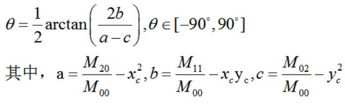

**HU 矩**

矩的不变性 (Moment invariants)：

- 平移不变 (Translation invariants)
- 缩放不变性 (Scale invariants)
- 旋转不变性 (Rotation invariants)

HU 用二阶和三阶中心距构造 7 个不变矩，满足上述 3 个不变性：

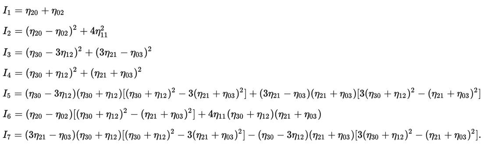

### 3.6 轮廓特性

[**Contour Features**](https://docs.opencv.org/4.1.2/dd/d49/tutorial_py_contour_features.html)：周长 (Perimeter)，面积 (area)，中心 (centroid)等

**[cv.moments()](https://docs.opencv.org/4.1.2/d3/dc0/group__imgproc__shape.html#ga556a180f43cab22649c23ada36a8a139)**：计算所有的矩，共 24 个

- 空间矩 (spatial moments) $m : 00;01,10;02,11,20;03,12,21,30->10$

- 中心距 (central moments) $mu : 20,11,02,30,21,12,03->7$，**中心矩是平移不变**

- 归一化中心距 (normalized central moments) $nu: 20,11,02,30,21,12,03->7$，**归一化的中心矩平移、缩放不变**

其余未出现的 $mu,nu:mu_{00}=m_{00}, nu_{00}=1, nu_{10}=mu_{10}=mu_{01}=mu_{10}=0 $

```python
# 面积area,M['m00']
area = cv.contourArea(cnt)
# 弧长
perimeter = cv.arcLength(cnt,True)
# 预估形状，DP道格拉斯-普克算法(Douglas–Peucker algorithm)
epsilon = 0.1*cv.arcLength(cnt,True) # 控制与实际弧线的精度
approx = cv.approxPolyDP(cnt,epsilon,True)
```

**检查是否是凸多边形**

**[cv.convexHull()](https://docs.opencv.org/4.1.2/d3/dc0/group__imgproc__shape.html#ga014b28e56cb8854c0de4a211cb2be656)**

凸状 (convex); 凸多边形(convexHull); Hull (外壳, 窗体); convexity defects (缺陷)

```python
k = cv.isContourConvex(cnt)
# 与 approx 类似
hull = cv.convexHull(cnt)
```

**2.矩形边框**

**[cv.boundingRect()](https://docs.opencv.org/4.1.2/d3/dc0/group__imgproc__shape.html#ga103fcbda2f540f3ef1c042d6a9b35ac7)**：正交的矩形边框，可能不是最小区域

```python
# x,y (左上角坐标) 是 top-left 坐标系，注意坐标 y 向下；w,h未边框的宽高
x, y, w, h = cv.boundingRect(cnt)
# 绘制矩形框,厚度2，颜色BGR,中 G,即绿色
cv.rectangle(img, (x,y), (x+w, y+h), (0,255,0), 2)
```

**Rotated Rectangle**

```python
# 返回值：( center (x,y), (width, height), angle of rotation ).
rect = cv.minAreaRect(cnt)
# 获得矩形 4 个角点
box = cv.boxPoints(rect)
# 格式变换
box = np.intp(box)
cv.drawContours(img, [box], 0, (0,0,255), 2)
```

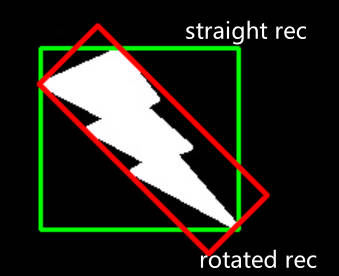

```python
img = cv.imread("img/03.jpg")
img_gray = cv.cvtColor(img, cv.COLOR_BGR2GRAY)

ret, img_threshold = cv.threshold(img_gray, 100, 255, 0)
contours, hierarchy = cv.findContours(img_threshold, cv.RETR_TREE, cv.CHAIN_APPROX_SIMPLE)

for cnt in contours:
    area = cv.contourArea(cnt)
    print(area)
    if area > 10 and area < 1000:
        rec = cv.minAreaRect(cnt)
        # print("min_A:", rec)
        box = cv.boxPoints(rec)
        box = np.intp(box)
        cv.drawContours(img, [box], 0, (0, 0, 255), 1)
cv.imshow("img", img)
cv.waitKey(0)
cv.destroyAllWindows()
```

**2.轮廓属性**

[**Contour Properties**](https://docs.opencv.org/4.1.2/d1/d32/tutorial_py_contour_properties.html)

```python
# 宽高比 ( Aspect Ratio)
x,y,w,h = cv.boundingRect(cnt)
aspect_ratio = float(w)/h

# 轮廓面积/矩形面积
area = cv.contourArea(cnt)
x,y,w,h = cv.boundingRect(cnt)
rect_area = w*h
extent = float(area)/rect_area
```

**3.人脸识别**

viola 和 Jones 提出最早检测方法之一，使用 Haar Cascade 方法查找，在某些场景下仍能很好地发挥作用。

opencv 在 Github 上的 [haarcascades 库](https://github.com/opencv/opencv/tree/master/data/haarcascades)

使用传统  [Haar Cascade xml 文件](https://github.com/opencv/opencv/tree/master/data/haarcascades) 方法进行识别

`detectMultiScale(image, scaleFactor, minNeighbors)`

- image:待处理的图像

- scaleFactor：检测框的最小尺寸

- minNeighbors：相当于检测的阈值，过小会出现误检现象，即把一些其他元素误判成人脸，过大可能会检测不到目标

```python
# 加载 xml 文件,打开失败的话需要使用绝对路径
faceCascade = cv.CascadeClassifier("res/haarcascade_frontalface_default.xml")
# faceCascade = cv.CascadeClassifier("res/haarcascade_eye.xml")
img = cv.imread('img/03.jpg')
imgGray = cv.cvtColor(img, cv.COLOR_BGR2GRAY)

# 函数返回值 (x,y,w,h)
faces = faceCascade.detectMultiScale(imgGray, 1.1, 1)

for (x, y, w, h) in faces:
    cv.rectangle(img, (x, y), (x+w, y+h), (255, 0, 0), 2)

cv.imshow("resimage", img)
cv.waitKey(0)
```

**4.轮廓的函数**

[**Contours : More Functions**](https://docs.opencv.org/4.1.2/d5/d45/tutorial_py_contours_more_functions.html)

**[cv.matchShapes()](https://docs.opencv.org/4.1.2/d3/dc0/group__imgproc__shape.html#gaadc90cb16e2362c9bd6e7363e6e4c317)**

基于  Hu-moment 进行计算，比较形状的相似性，特别是由原来图片旋转，平移，缩放而来的；

```python
img1 = cv.imread('image/01.jpg',0)
img2 = cv.imread('image/02.jpg',0)
ret, thresh = cv.threshold(img1, 127, 255,0)
ret, thresh2 = cv.threshold(img2, 127, 255,0)
contours,hierarchy = cv.findContours(thresh,2,1)
cnt1 = contours[0]
contours,hierarchy = cv.findContours(thresh2,2,1)
cnt2 = contours[0]
ret = cv.matchShapes(cnt1,cnt2,1,0.0)
print( ret )
```

## 4.Project

### 4.1 虚拟画笔

[Virtual Paint](https://github.com/murtazahassan/Learn-OpenCV-in-3-hours/blob/master/project1.py)


