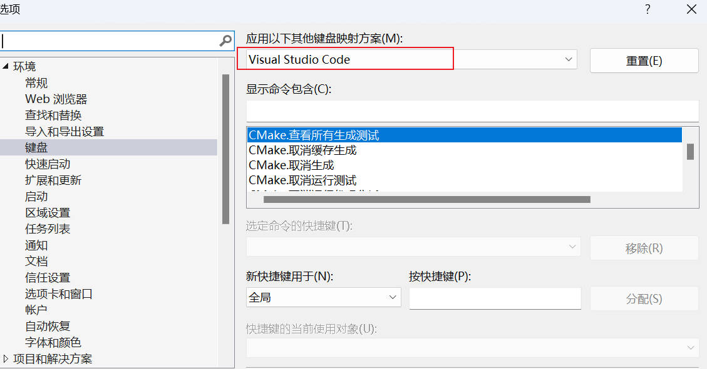

# OpenCV

[官网教程](https://docs.opencv.org/4.x/d9/df8/tutorial_root.html)

## 1.基础

### 1.1 OpenCV概念

图像处理一般指数字图像处理，图像处理技术：

- 图像压缩
- 增强和复原
- 匹配、描述和识别

图像处理和计算机视觉的区别：

- 图像处理侧重于**处理图像**
- 计算机视觉则重点在于使用计算机**进行视觉模拟**

OpenCV (Open Source Computer Vision Library) 是一个基于开源发行的跨平台**计算机视觉库**，实现了图像处理和计算机视觉方面的多种通用算法。

OpenCV 1999 由 Intel 建立，是一个基于**开源发行跨平台**的计算机视觉库，目前由 Willow Garage 提供支持。采用 C/C++ 代码编写，能够利用多核处理器的优势，目标是构建一个简单易用的计算机视觉框架。

创造之初的三大目标：

- 提供开放且优化的源代码
- 提供通用的架构来传播视觉知识
- OpenCV 库采用的协议不要求商业产品继续开放代码

### 1.2 安装和配置

[OpenCV 4.6.0](https://sourceforge.net/projects/opencvlibrary/files/4.6.0/opencv-4.6.0-vc14_vc15.exe/download) | [参考教程](https://blog.csdn.net/weixin_42450976/article/details/125749045) | [visualstudio 2017(vc15) 下载](https://www.xxrjm.com/6059.html) | [错误解决方案](https://blog.csdn.net/weixin_39354845/article/details/128461866)

下载解压后有两个文件夹：

- build: 支持 OpenCV 使用的相关文件
- sources: OpenCV 的源代码及相关代码，里面有示例文件和说明文档等

**环境配置**

- 配置包含目录
- 配置库目录
- 配置连接器
- 配置环境变量
- 重新启动 VS 2017

### 1.3 示例讲解

**快捷键设定**

注释快捷键：`Ctrl+/`；取消注释：`Ctrl+Shift+/`

选择 工具 => 选项，弹出以下窗口：



**示例代码**

```c++
//OpenCV中主要的头文件是include “opencv2/opencv.hpp”它可以调用每个 Opencv 模块的头文件
#include <opencv2/opencv.hpp>
#include <iostream>
using namespace std;
using namespace cv;
int main()
{
	// Matrix 矩阵
	Mat img = imread("img//0100.jpg", IMREAD_GRAYSCALE); //灰度图像IMREAD_GRAYSCALE
	if (img.empty()) {
		printf("could not load image!\n");
		return -1;
	}
	namedWindow("window01", WINDOW_FREERATIO);
	imshow("window01", img); //imshow无法调整图片AUTOSIZE
	waitKey(0); // 1 表示1ms
	destroyAllWindows();
	return 0;
}
```


