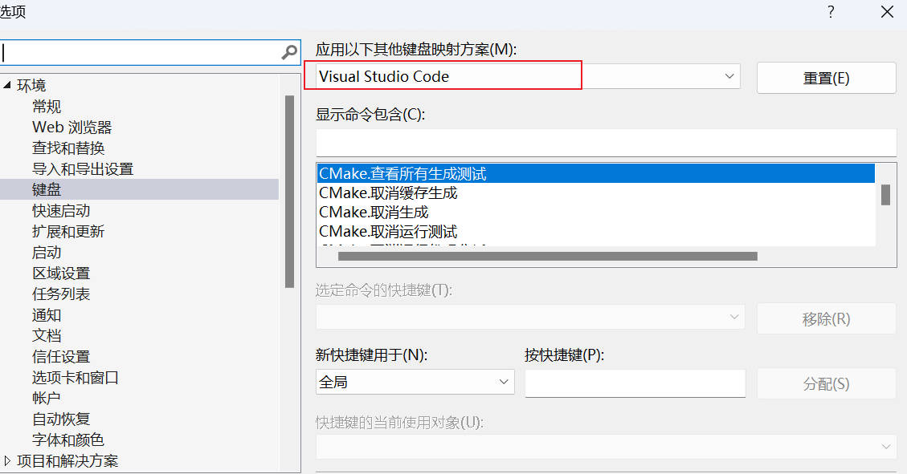

# CV_intro

> 参考书籍：《从零学习OpenCV 4》| [官网教程](https://docs.opencv.org/4.x/d9/df8/tutorial_root.html)

## 1. OpenCV概念

图像处理一般指数字图像处理，图像处理技术：

- 图像压缩
- 增强和复原
- 匹配、描述和识别

图像处理和计算机视觉的区别：

- 图像处理侧重于**处理图像**
- 计算机视觉则重点在于使用计算机**进行视觉模拟**

OpenCV (Open Source Computer Vision Library) 是一个基于开源发行的跨平台**计算机视觉库**，实现了图像处理和计算机视觉方面的多种通用算法。

OpenCV 1999 由 Intel 建立，是一个基于**开源发行跨平台**的计算机视觉库，目前由 Willow Garage 提供支持。采用 C/C++ 代码编写，能够利用多核处理器的优势，目标是构建一个简单易用的计算机视觉框架。

创造之初的三大目标：

- 提供开放且优化的源代码
- 提供通用的架构来传播视觉知识
- OpenCV 库采用的协议不要求商业产品继续开放代码

## 2. 安装和配置

#### 说明

OpenCV4 简易安装

OpenCV4 + OpenCV-Contrib 扩展模块(包含新加的内容，如专利内容等)

### 2.1基础模块安装和环境配置

#### 1.安装包准备

[历史版本界面](https://opencv.org/releases/)|[OpenCV 4.6.0](https://sourceforge.net/projects/opencvlibrary/files/4.6.0/opencv-4.6.0-vc14_vc15.exe/download) | [参考教程](https://blog.csdn.net/weixin_42450976/article/details/125749045) | [visualstudio 2017(vc15) 下载](https://www.xxrjm.com/6059.html) | [错误解决方案](https://blog.csdn.net/weixin_39354845/article/details/128461866)


下载解压后有两个文件夹：

- build: 支持 OpenCV 使用的相关文件
- sources: OpenCV 的源代码及相关代码，里面有示例文件和说明文档等

#### 2.环境配置

**1.本地电脑环境配置**

配置环境变量(告诉电脑 OpenCV4 的安装位置)

`D:\opencv\build\x64\vc15\bin`

**2.VS2017 项目文件配置**

- 配置包含目录和库目录

  

- 配置链接器，d 表示可 debug

  

- 重新启动 VS 2017

**可将配置保存为一个属性文件 `opencv4.6.0.props` 以后新建项目，只需要将 Microsoft.Cpp.x64.user 的删掉，并添加 `opencv4.6.0.props`  即可。**

**备注**

- vc14 -> VS2015
- vc15 -> VS2017

### 2.2拓展模块安装和环境配置

#### 1.前期安装准备

**下载 opencv 和 opencv_contrib**

- [opencv4.6.0](https://sourceforge.net/projects/opencvlibrary/files/4.6.0/opencv-4.6.0-vc14_vc15.exe/download) 和 [opencv-contrib](https://www.raoyunsoft.com/opencv/opencv_contrib/) 的版本应具有一致性

- 安装 [Cmake 3.10.3](https://cmake.org/files/v3.10/) (可识别 VS2017及之前的版本，太旧的版本无法识别较新的 VS 版本)，用 Cmake 编译 OpenCV4


#### 2.Cmake 编译

参考教程：[Cmake 配置Opencv以及拓展库](https://zhuanlan.zhihu.com/p/114526376)

**1.首次编译**

- 第一行是 `opencv/sources` (opencv 源码)的路径。

- 第二行是自定义的保存的路径，最好与源码为同一目录：`opencv/newbuild `

  

- 选择与 VS 2017 对应的版本（第一次点击 `Configure` 会出现选择版本界面），然后点击 `Configure`

  

**2.第二次编译**

1.指定扩展包的路径，找到 `OPENCV_EXTRA MODULES PATH` ，添加 `opencv-contrib` 中 `modeules` 的路径

同时勾选 `OPENCV_ENABLE_NONFREE`，允许使用有专利的项目


2.去除：`WITH_MSMF` 和 `WITH_MSMFDXVA` 选项


3.再次选择 `Configure` 进行编译，完成后再选择 `generate` 

**3.VS 编译**

1.上述都完成后，点击 `Open Project` 用 VS2017 打开项目：


选择 `×64` 并 `重新生成解决方案` 开始进行编译


2.而后找到 `INSTALL` ，右键选择：`仅用于项目` => `仅生成 INSTALL`


#### 3.环境配置

同简易模块的配置类似

**1.本地电脑环境配置**

配置环境变量(告诉电脑 OpenCV4 编译好的文件所在的位置)

`D:\opencv\newbuild\install\x64\vc15\bin`

**2.项目文件配置**

设置为 `×64` 并添加新的属性列表 `opencv4_extra.props`


打开属性文件进行配置：

- 配置包含目录和库目录

  `D:\opencv\newbuild\install\include\opencv2` 

  `D:\opencv\newbuild\install\include` 

  `D:\opencv\newbuild\install\x64\vc15\lib`

  

- 配置链接器

  导入 `D:\opencv\newbuild\install\x64\vc15\lib` 中的所有依赖文件：

  在 `D:\opencv\newbuild\install\x64\vc15\lib` 打开终端，输入 `python` 并运行以下命令得到所有的文件名称：(去除 .cmake 文件即可)

  

  ```text
  opencv_aruco460d.lib
  opencv_barcode460d.lib
  opencv_bgsegm460d.lib
  opencv_bioinspired460d.lib
  opencv_calib3d460d.lib
  opencv_ccalib460d.lib
  opencv_core460d.lib
  opencv_datasets460d.lib
  opencv_dnn460d.lib
  opencv_dnn_objdetect460d.lib
  opencv_dnn_superres460d.lib
  opencv_dpm460d.lib
  opencv_face460d.lib
  opencv_features2d460d.lib
  opencv_flann460d.lib
  opencv_fuzzy460d.lib
  opencv_gapi460d.lib
  opencv_hfs460d.lib
  opencv_highgui460d.lib
  opencv_imgcodecs460d.lib
  opencv_imgproc460d.lib
  opencv_img_hash460d.lib
  opencv_intensity_transform460d.lib
  opencv_line_descriptor460d.lib
  opencv_mcc460d.lib
  opencv_ml460d.lib
  opencv_objdetect460d.lib
  opencv_optflow460d.lib
  opencv_phase_unwrapping460d.lib
  opencv_photo460d.lib
  opencv_plot460d.lib
  opencv_quality460d.lib
  opencv_rapid460d.lib
  opencv_reg460d.lib
  opencv_rgbd460d.lib
  opencv_saliency460d.lib
  opencv_shape460d.lib
  opencv_stereo460d.lib
  opencv_stitching460d.lib
  opencv_structured_light460d.lib
  opencv_superres460d.lib
  opencv_surface_matching460d.lib
  opencv_text460d.lib
  opencv_tracking460d.lib
  opencv_video460d.lib
  opencv_videoio460d.lib
  opencv_videostab460d.lib
  opencv_wechat_qrcode460d.lib
  opencv_xfeatures2d460d.lib
  opencv_ximgproc460d.lib
  opencv_xobjdetect460d.lib
  opencv_xphoto460d.lib
  ```

  

## 3. 示例讲解

**快捷键设定**

注释快捷键：`Ctrl+/`；取消注释：`Ctrl+Shift+/`

选择 工具 => 选项，弹出以下窗口：



#### 3.1基础版示例代码

注意提前在本地电脑设置好图片所在的路径！！！

```c++
//OpenCV中主要的头文件是include “opencv2/opencv.hpp”它可以调用每个 Opencv 模块的头文件
#include <opencv2/opencv.hpp>
#include <iostream>
using namespace std;
using namespace cv;
int main()
{
	// Matrix 矩阵
    //或使用本地文件路径，E:/OpenCV_intro/test_img/01.jpg
	Mat img = imread("01.jpg", IMREAD_GRAYSCALE); //灰度图像IMREAD_GRAYSCALE
	if (img.empty()) {
		printf("could not load image!\n");
		return -1;
	}
	namedWindow("window01", WINDOW_FREERATIO);
	imshow("window01", img); //imshow无法调整图片AUTOSIZE
	waitKey(0); // 1 表示1ms
	destroyAllWindows();
	return 0;
}
```

#### 3.2拓展版代码示例

用于测试基础模块没有的 `SIFT算法`

```c++
#include <iostream>
#include<opencv2\opencv.hpp>
#include "opencv2/xfeatures2d.hpp"

using namespace cv;
using namespace std;
using namespace xfeatures2d;
int main()
{
	Mat matSrc = imread("E:/OpenCV_intro/test_img/01.jpg");
	Mat draw;


	std::vector<KeyPoint> keypoints;
	auto sift_detector = SIFT::create();
	sift_detector->detect(matSrc, keypoints);


	drawKeypoints(matSrc, keypoints, matSrc);
	imshow("gray", matSrc);
	waitKey(0);
	return 0;
}
```


